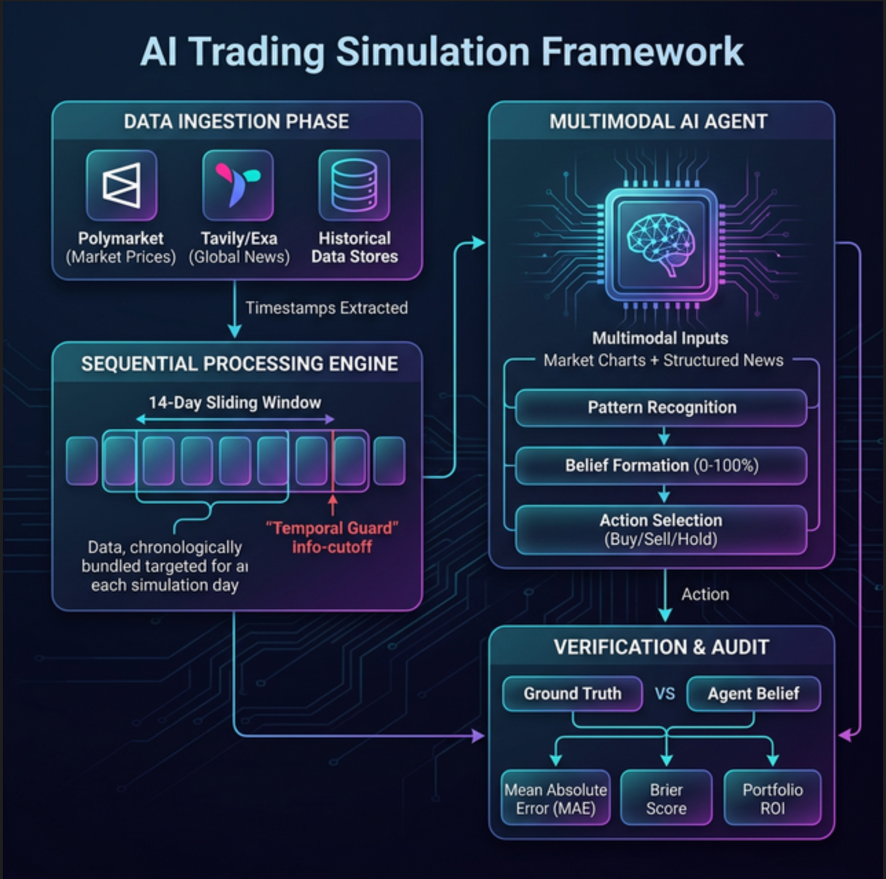

# Research-Lookahead-AI: Final Simulation Framework

This document provides a comprehensive, high-fidelity overview of the **Sequential Multimodal Trading Research Framework**. It is designed to ensure maximum transparency and zero-leakage integrity for AI-driven prediction market analysis.

## 🗺️ System Architecture Flowchart

Below is the end-to-end visual architecture of the system, from raw data ingestion to final ground-truth resolution.

**Simulation Framework Flowchart**


---

## 📊 Detailed 14-Day Simulation Case Studies

### 🔹 Example 1: Hindsight Analysis (Archived Data)
*This example uses archived data originating from Polymarket.*

**Command:**
```bash
python3 evaluate.py --log_file /runs/biden-covid-free-by-next-friday/will-joe-biden-be-covid-free-by-next-friday-july-2_20260226_014634/experiment.jsonl
```

**Evaluation Output:**
```text
--- Evaluating Simulation: /runs/biden-covid-free-by-next-friday/will-joe-biden-be-covid-free-by-next-friday-july-2_20260226_014634/experiment.jsonl ---

1. Financial Performance (PnL / ROI)
------------------------------------------------------------
Starting Value: $1000.00
Final Value:    $1013.25
Total PnL:      $13.25 (+1.32%)

2. Daily Price Alignment (Agent Belief vs. Market Truth)
------------------------------------------------------------
Day  1 | HOLD            | Start-Cash: $1000.00 | Start-Pos:   0 | Price: 0.74 | Belief: 0.50 | End-Portfolio: $1000.00
Day  2 | BUY 100 @ 0.85  | Start-Cash: $1000.00 | Start-Pos:   0 | Price: 0.85 | Belief: 0.95 | End-Portfolio: $ 999.50
Day  3 | HOLD            | Start-Cash: $ 914.00 | Start-Pos: 100 | Price: 0.82 | Belief: 0.85 | End-Portfolio: $ 996.50
Day  4 | HOLD            | Start-Cash: $ 914.00 | Start-Pos: 100 | Price: 0.86 | Belief: 0.90 | End-Portfolio: $1000.00
Day  5 | HOLD            | Start-Cash: $ 914.00 | Start-Pos: 100 | Price: 0.83 | Belief: 0.90 | End-Portfolio: $ 997.00
Day  6 | HOLD            | Start-Cash: $ 914.00 | Start-Pos: 100 | Price: 0.79 | Belief: 0.95 | End-Portfolio: $ 992.50
Day  7 | SELL 100 @ 1.00 | Start-Cash: $ 914.00 | Start-Pos: 100 | Price: 1.00 | Belief: 1.00 | End-Portfolio: $1013.45
Day  8 | HOLD            | Start-Cash: $1013.45 | Start-Pos:   0 | Price: 1.00 | Belief: 1.00 | End-Portfolio: $1013.45
Day  9 | BUY 20 @ 0.50   | Start-Cash: $1013.45 | Start-Pos:   0 | Price: 0.50 | Belief: 0.95 | End-Portfolio: $1013.25

=> Mean Absolute Error (MAE): 0.121
=> Brier Score (MSE):          0.034 (Lower is better)
Verdict: Acceptable Calibration.

3. Final Outcome Alignment
------------------------------------------------------------
Predicted Outcome: STALEMATE (Price: 0.50)
Final Agent Position: 0 shares
Verdict: INCONCLUSIVE. No clear ground truth available (Unresolved or Stale Data).

4. Reasoning Excerpts
------------------------------------------------------------
Day 1: Biden tested positive for COVID-19 on July 17, 2024, and is experiencing mild symptoms. Given the typical recovery time for COVID-19, it is uncertain whether he will be COVID-free by July 26, 2024.
Day 5: Biden tested positive for COVID-19 on July 17, 2024, but recent updates indicate significant improvement in his condition. He has completed his Paxlovid treatment, and his symptoms have resolved. 
Day 9: Recent news confirms that President Biden has tested negative for COVID-19 and his symptoms have resolved. This aligns with the market resolution rules, which state that a negative test or confirmatio...
```

**Data Reference:** 
[/raw_data](file:///runs/biden-covid-free-by-next-friday/will-joe-biden-be-covid-free-by-next-friday-july-2_20260226_014634/raw_data)

---

### 🟢 Example 2: Live Market Analysis
*This example demonstrates behavior in an active live market.*

**Command:**
```bash
python3 evaluate.py --log_file /runs/sucre-mayoral-election-winner-bolivia/who-will-win-the-sucre-mayoral-election-in-bolivia_20260225_225839/experiment.jsonl
```

**Evaluation Output:**
```text
--- Evaluating Simulation: /runs/sucre-mayoral-election-winner-bolivia/who-will-win-the-sucre-mayoral-election-in-bolivia_20260225_225839/experiment.jsonl ---

1. Financial Performance (PnL / ROI)
------------------------------------------------------------
Starting Value: $999.50
Final Value:    $929.10
Total PnL:      $-70.40 (-7.04%)

2. Daily Price Alignment (Agent Belief vs. Market Truth)
------------------------------------------------------------
Day  1 | BUY 100 @ 0.26  | Start-Cash: $1000.00 | Start-Pos:   0 | Price: 0.26 | Belief: 0.55 | End-Portfolio: $ 999.50
Day  2 | SELL 50 @ 0.20  | Start-Cash: $ 974.00 | Start-Pos: 100 | Price: 0.20 | Belief: 0.20 | End-Portfolio: $ 994.25
Day  3 | BUY 100 @ 0.23  | Start-Cash: $ 984.00 | Start-Pos:  50 | Price: 0.23 | Belief: 0.55 | End-Portfolio: $ 994.75
Day  4 | BUY 100 @ 0.25  | Start-Cash: $ 961.00 | Start-Pos: 150 | Price: 0.25 | Belief: 0.55 | End-Portfolio: $ 998.00
Day  5 | BUY 100 @ 0.26  | Start-Cash: $ 935.50 | Start-Pos: 250 | Price: 0.26 | Belief: 0.55 | End-Portfolio: $ 998.75
Day  6 | SELL 350 @ 0.07 | Start-Cash: $ 909.50 | Start-Pos: 350 | Price: 0.07 | Belief: 0.07 | End-Portfolio: $ 930.50
Day  7 | BUY 100 @ 0.22  | Start-Cash: $ 930.50 | Start-Pos:   0 | Price: 0.22 | Belief: 0.55 | End-Portfolio: $ 930.00
Day  8 | HOLD            | Start-Cash: $ 908.00 | Start-Pos: 100 | Price: 0.21 | Belief: 0.55 | End-Portfolio: $ 929.50
Day  9 | HOLD            | Start-Cash: $ 908.00 | Start-Pos: 100 | Price: 0.15 | Belief: 0.55 | End-Portfolio: $ 923.00
Day 10 | SELL 100 @ 0.23 | Start-Cash: $ 908.00 | Start-Pos: 100 | Price: 0.23 | Belief: 0.23 | End-Portfolio: $ 930.50
Day 11 | BUY 100 @ 0.05  | Start-Cash: $ 930.50 | Start-Pos:   0 | Price: 0.05 | Belief: 0.55 | End-Portfolio: $ 930.00
Day 12 | SELL 100 @ 0.08 | Start-Cash: $ 925.10 | Start-Pos: 100 | Price: 0.08 | Belief: 0.08 | End-Portfolio: $ 932.30
Day 13 | BUY 100 @ 0.05  | Start-Cash: $ 932.30 | Start-Pos:   0 | Price: 0.05 | Belief: 0.33 | End-Portfolio: $ 931.80
Day 14 | SELL 100 @ 0.03 | Start-Cash: $ 926.70 | Start-Pos: 100 | Price: 0.03 | Belief: 0.03 | End-Portfolio: $ 929.10

=> Mean Absolute Error (MAE): 0.220
=> Brier Score (MSE):          0.077 (Lower is better)
Verdict: Acceptable Calibration.

3. Final Outcome Alignment
------------------------------------------------------------
Predicted Outcome (Price Proxy): 0.03
Final Agent Position: 100 shares
Verdict: FAILED. Agent held positions for the losing outcome.

4. Reasoning Excerpts
------------------------------------------------------------
Day 1: The recent disqualification of Horacio Poppe, a major opposition candidate, significantly increases the chances of Enrique Leaño winning the election. AI predictions also favor Leaño with a 55.7% prob...
Day 8: Recent news indicates a strong favor towards Enrique Leaño due to the disqualification of his main rival, Horacio Poppe. AI predictions also support Leaño with a high probability. However, the market ...
Day 14: The recent news indicates a strong likelihood of Enrique Leaño winning the Sucre mayoral election due to the disqualification of his main rival, Horacio Poppe. The AI predictions and analysis suggest ...
```

**Data Reference:**
[/raw_data](file:///runs/sucre-mayoral-election-winner-bolivia/who-will-win-the-sucre-mayoral-election-in-bolivia_20260225_225839/raw_data)

---

### 🟠 Example 3: Archived Data Analysis
*This example utilizes historical data for hindsight testing.*

**Command:**
```bash
python3 evaluate.py --log_file /runs/will-us-supreme-court-vote-to-reinstate-trump-on-colorados-2024-ballot/will-us-supreme-court-vote-to-reinstate-trump-on-c_20260226_021518/experiment.jsonl
```

**Evaluation Output:**
```text
--- Evaluating Simulation: /runs/will-us-supreme-court-vote-to-reinstate-trump-on-colorados-2024-ballot/will-us-supreme-court-vote-to-reinstate-trump-on-c_20260226_021518/experiment.jsonl ---

1. Financial Performance (PnL / ROI)
------------------------------------------------------------
Starting Value: $1000.00
Final Value:    $1670.00
Total PnL:      $670.00 (+67.00%)

2. Daily Price Alignment (Agent Belief vs. Market Truth)
------------------------------------------------------------
Day  1 | BUY 3571 @ 0.28 | Start-Cash: $1000.00 | Start-Pos:   0 | Price: 0.28 | Belief: 1.00 | End-Portfolio: $1000.00
Day  2 | BUY 1000 @ 0.26 | Start-Cash: $1000.00 | Start-Pos:   0 | Price: 0.26 | Belief: 1.00 | End-Portfolio: $ 995.00
Day  3 | SELL 1000 @ 0.94 | Start-Cash: $ 740.00 | Start-Pos: 1000 | Price: 0.94 | Belief: 1.00 | End-Portfolio: $1670.00

=> Mean Absolute Error (MAE): 0.510
=> Brier Score (MSE):          0.359 (Lower is better)
Verdict: Poor Calibration.

3. Final Outcome Alignment
------------------------------------------------------------
Predicted Outcome (Price Proxy): 0.94
Final Agent Position: 1000 shares
Verdict: SUCCESS. Agent held positions for the winning outcome.

4. Reasoning Excerpts
------------------------------------------------------------
Day 1: The U.S. Supreme Court has unanimously ruled to restore Trump to the Colorado ballot, which directly resolves the market to 'Yes'. The current price of 0.28 is significantly below my belief probabilit...
Day 2: The U.S. Supreme Court has unanimously ruled to restore Trump to the Colorado ballot, which directly resolves the market to 'Yes'. The current price of 0.26 is significantly below my belief probabilit...
Day 3: The U.S. Supreme Court has unanimously ruled to restore Trump to the Colorado ballot, which directly resolves the market to 'Yes'. Therefore, the belief probability is 1.0, and it is optimal to sell a...
```

**Data Reference:** 
[/raw_data](file:///runs/will-us-supreme-court-vote-to-reinstate-trump-on-colorados-2024-ballot/will-us-supreme-court-vote-to-reinstate-trump-on-c_20260226_021518/raw_data)

---

## 📂 Additional Resources

These listed items represent just a subset of available experiments. There are many more simulation runs stored in the [runs/](file:///runs) directory.

**Running Evaluations:**
You can execute the evaluation script for any simulation run using the following command structure:
```bash
python3 evaluate.py --log_file <path_to_experiment.jsonl>
```

---

## 📌 Summary of Research Integrity

1.  **Sliding 14-Day Horizon**: Every day is an independent 14-day lookback window.
2.  **Resolved-Only Filter**: Guaranteed ground-truth for hindsight calibration runs.
3.  **Zero-Leakage Barrier**: Strict "Temporal Guard" cutoff ensures the agent never sees future data.